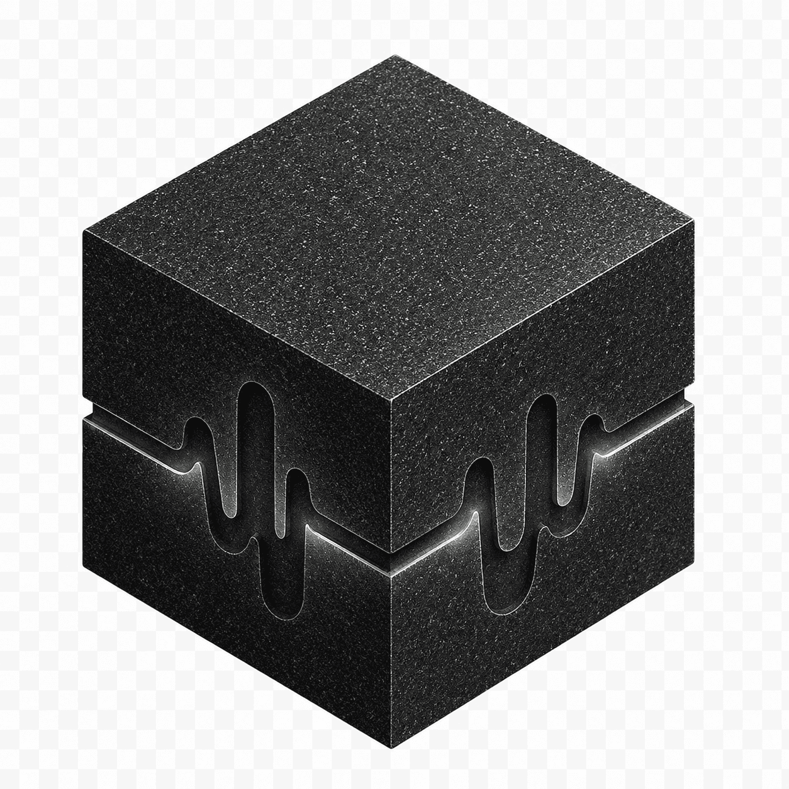

<p align="center">
  
</p>

<h1 align="center">Bedrock Voice</h1>

<p align="center">
  <i>An accessibility-first reading companion for your second brain.</i><br/>
  <sub>Karaoke captions. Local TTS. No metered API. Built for ADHD, dyslexia, and information overload.</sub>
</p>

<p align="center">
  <a href="LICENSE"></a>
  <a href="docs/ACCESSIBILITY.md"></a>
  <a href="https://huggingface.co/hexgrad/Kokoro-82M"></a>
  
  <a href="#why-this-stays-on-your-machine"></a>
  <a href="https://github.com/opendian"></a>
</p>

<p align="center">
  <a href="https://opendian.github.io/bedrock/"><strong>opendian.github.io/bedrock</strong></a> — the landing page
</p>

<p align="center">Bedrock Voice reads your Obsidian notes aloud — with karaoke captions that highlight each word as it's spoken. Runs locally on your Mac. No notes leave your machine.</p>

<p align="center">
  <a href="docs/screenshots/hero.mp4">
    
  </a>
  <br/>
  <sub><i>Click the GIF for the high-res MP4. The plugin runs at the speed and quality shown.</i></sub>
</p>

---

## Why this exists

If you have ADHD, dyslexia, an auditory processing difference, or you just live in 2026 with too many notes — reading the things you wrote down can be the hardest part of having written them.

Bedrock Voice is built around one observation: **bi-modal reading** (seeing a word + hearing it at the same moment) is one of the most-studied, lowest-tech accessibility interventions there is. It's the foundation of [Bookshare](https://www.bookshare.org/), [Kurzweil 3000](https://www.kurzweiledu.com/products/kurzweil-3000.html), [Speechify](https://speechify.com), and a generation of school-library reading tools — but those are SaaS, locked-in, expensive, and not built for the way you actually take notes.

This is the same idea, opinionated for Obsidian, **local-first**, free as in MIT.

---

## What it does

- **Reads any note aloud** with a clean local voice (Kokoro 82M, Apache-2).
- **Karaoke captions** float over Obsidian, highlighting the current word and current sentence as they're spoken.
- **Tightens the spoken script** with an LLM pass first — your note as cadence, not as raw text-dump.
- **Caches everything** — clicking the read button twice on an unchanged note replays the existing audio instantly. Edit the note → next click regenerates.

<p align="center">
  
</p>

## Who it's for

| If you… | …this is for you |
| --- | --- |
| Have **ADHD** and lose the thread re-reading your own notes | Hearing + seeing simultaneously cuts attention drift. Audio anchors the eyes. |
| Are **dyslexic** | The karaoke pattern is the canonical dyslexia accommodation. This puts it on your second brain. |
| Have an **auditory processing** difference | Self-paced playback (0.75× – 1.75×), Space to pause anytime, no autoplay surprise. |
| Are **autistic** and need predictable pacing | No notifications, no ambient sounds, no animation beyond the highlight. |
| Have **screen fatigue** or eye strain | Look away. Keep listening. The note keeps reading. |
| Are **overwhelmed by your own vault** | Audio while walking, cooking, commuting. The notes you wrote to think become the notes you listen to remember. |
| Are **multilingual** (the project author is FR + EN) | English narration is rewritten for spoken cadence. French stays French. |

Bedrock Voice doesn't pretend to be a clinical tool. It's a thoughtful default — the small accessibility win that should have been built into every note app from day one.

---

## How it works

```
Obsidian note ──▶ Plugin (TS) ──▶ Python pipeline ──▶ Karaoke HUD
                                  │
                                  ├─ Extract source (tldr + H2, or whole body)
                                  ├─ Tighten for speech (Claude/Codex CLI, or local MLX)
                                  ├─ Synthesize sentence-by-sentence (Kokoro)
                                  └─ Return wav + per-sentence timing JSON
```

The plugin shells out to a small Python pipeline. The pipeline does the work and returns a JSON payload the plugin uses to drive the audio and the HUD. The audio file and the sentence timings are cached on disk next to your vault — no recompute when nothing changed.

For the technical architecture, see [docs/architecture.md](docs/architecture.md).

---

## Accessibility design choices

These aren't features tacked on — they're the spine of the project. Full notes in [docs/ACCESSIBILITY.md](docs/ACCESSIBILITY.md).

- **Bi-modal by default.** Audio is always paired with synced visual highlight. Not one or the other.
- **Self-paced playback.** 0.75× through 1.75× without re-synthesizing.
- **Keyboard-first controls.** Space to toggle, Escape to close. No mouse hunt.
- **No autoplay surprise.** Audio only starts when you explicitly trigger the read command.
- **Predictable HUD.** Same position, same size, no animation beyond the word highlight.
- **High-contrast captions.** Honors your Obsidian theme; falls back to readable defaults.
- **No notification sounds.** Ever.
- **Cache-first.** A second click on an unchanged note replays instantly — no waiting penalty.
- **Local TTS.** Sensitive personal notes never leave your machine.

---

## Platform support — v0.1

> [!important]
> **v0.1 is macOS Apple Silicon only.** Windows, Linux, and Intel Macs are not supported yet.

| Platform | Status |
| --- | --- |
| **macOS Apple Silicon** | ✅ Supported — tested daily |
| macOS Intel | ⚠ Kokoro TTS works, but the default `local` LLM backend (MLX) does not. Switch backend to `claude`/`codex` if you have those CLIs. |
| Linux | 🚧 Not yet. PRs welcome. |
| Windows | 🚧 Not yet — install path needs rewriting (no bash, no brew). |
| iOS / Android | ❌ Obsidian mobile can't shell out to Python. |

If you're not on Apple Silicon, stop here. The install will fail or the plugin will degrade silently — neither is fun.

---

## Install

Two steps. Five minutes if Homebrew is already on your machine.

### 1. Plugin via BRAT

1. Install [BRAT](https://github.com/TfTHacker/obsidian42-brat) from Obsidian community plugins.
2. BRAT → "Add Beta Plugin" → paste:
   ```
   opendian/bedrock
   ```
3. Enable **Bedrock Voice** under Settings → Community plugins.

### 2. One command for the pipeline

```bash
cd "<your-vault>/.obsidian/plugins/bedrock-voice/voice" && bash install.sh
```

The installer:

- Verifies macOS Apple Silicon (fails fast with a clear message otherwise).
- Installs Homebrew if missing (asks first).
- Installs Python 3.12, espeak-ng, ffmpeg.
- Creates a `.venv` and installs Kokoro + MLX-LM.
- Smoke-tests the pipeline.

First run: 3–6 minutes. First read: another ~30s while Kokoro and MLX warm up.

### Backend (the honest part)

The default backend is **`local`** — MLX-LM running fully offline on your machine. No API key, no subscription, no `OPENAI_API_KEY`, no `ANTHROPIC_API_KEY`. Script tightening takes 8–20 seconds per read on `local`. 

If you already have **Claude Code** or the **OpenAI Codex CLI** installed (subscription auth, $0 marginal), switch in Settings → Bedrock Voice → LLM backend → `claude` or `codex`. Script tightening drops to 1–4 seconds.

We default to `local` so the "no metered API" claim is true for everyone, not just CLI power users.

---

## Usage

<p align="center">
  
</p>

- **Ribbon icon** (`audio-lines`) or **command palette** → "Read note aloud with captions".
- **Spacebar** — toggle play / pause.
- **Escape** — close the caption HUD.
- **Speed dropdown** — 0.75× through 1.75×, no re-synthesis.
- **"Stop reading"** command — hard stop mid-sentence.

The HUD floats over your note. The current sentence is foregrounded; the next sentence previews underneath. Each word lights up as it's spoken.

---

## Settings

| Setting | What it does |
| --- | --- |
| **LLM backend** | `claude` / `codex` / `local`. All three avoid metered APIs. |
| **Narration language** | English (rewritten for cadence) or French (kept French). |
| **Kokoro voice** | Default `af_heart`. See [Kokoro voices](https://huggingface.co/hexgrad/Kokoro-82M#voices). |
| **Default speed** | Playback rate, 0.75× – 1.75×. |
| **Read whole note** | Off: `tldr` frontmatter + H2 headers. On: the full body. |
| **Voice pipeline path** | Where the Python pipeline lives. Empty = bundled `<plugin>/voice/`. |

---

## Why this stays on your machine

Most TTS plugins use a hosted API (ElevenLabs, OpenAI, Cartesia). That model is:

- **Expensive** — pennies per minute add up fast on a daily-use vault.
- **Privacy-leaky** — every note you read goes to a third-party server.
- **Lock-in** — your TTS history isn't yours.

Bedrock Voice was built for a personal vault where every read shouldn't tick a meter — and where notes about your finances, therapy, code, or family don't belong on someone else's server.

| Component | Where it runs | What it costs |
| --- | --- | --- |
| TTS (Kokoro 82M) | Locally, on your CPU | $0 |
| **Default backend** — script tightening (`local`) | MLX-LM in-process | **$0 (fully offline)** |
| Optional — script tightening (`claude`) | Claude Code CLI auth (subscription) | $0 marginal if you already pay |
| Optional — script tightening (`codex`) | OpenAI Codex CLI auth (subscription) | $0 marginal if you already pay |

The honest version: the **default path is $0 with no external auth required**. The CLI backends are faster but only free if you already have those subscriptions — we made `local` the default so the no-meter promise holds even if you don't.

---

## Roadmap

- [x] Cache audio + captions on note mtime
- [x] Configurable voice pipeline path
- [ ] **Submit to Obsidian community plugins**
- [ ] **Windows + Linux testing**
- [ ] **Per-word timestamps** via forced alignment (currently char-interpolated within sentence)
- [ ] **Dyslexia-friendly font option** for the HUD (OpenDyslexic, Atkinson Hyperlegible)
- [ ] **Background ambient reading mode** — read selection without HUD
- [ ] **Read selection** instead of whole note / TLDR
- [ ] **Anki + Readwise export**
- [ ] **More languages** (Kokoro supports several)

Issues and pull requests welcome. See [CONTRIBUTING.md](CONTRIBUTING.md).

---

## Repository layout

```
bedrock-voice/
├── plugin/            TypeScript Obsidian plugin
├── voice/             Python pipeline (Kokoro + LLM tightening)
├── docs/
│   ├── architecture.md       How the pieces fit together
│   ├── ACCESSIBILITY.md      Design choices in detail
│   └── screenshots/          Hero + feature images
├── .github/workflows/  CI: build + release
├── LICENSE             MIT
└── README.md           This file
```

---

## Acknowledgements

- [**Kokoro 82M**](https://huggingface.co/hexgrad/Kokoro-82M) by hexgrad. This whole project sits on this voice.
- [**MLX**](https://github.com/ml-explore/mlx) by Apple. Native-on-Silicon inference, no fuss.
- [**Obsidian**](https://obsidian.md) — the canvas this is painted onto.
- Everyone who's ever asked their note app to read something out loud and gotten back robot voice + no highlight + a bill.

---

## License

MIT. See [LICENSE](LICENSE).

— [Yani Meziani](https://meziani.org)
